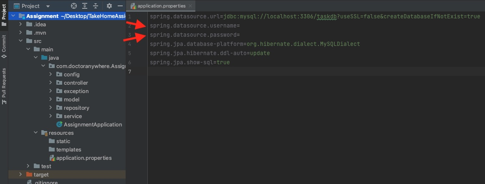
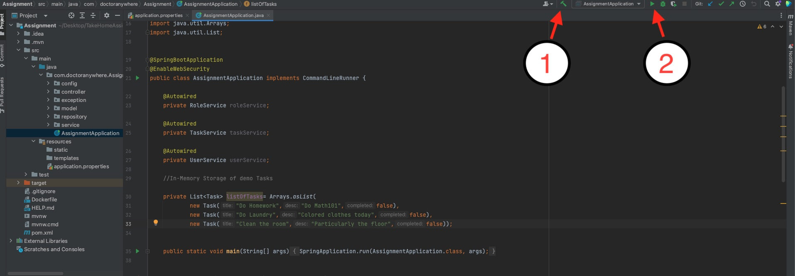

# Project Title
Task RESTful API

## Description

A simple RESTful API to retrieve data about your daily Tasks built using Java and Spring Boot with MySQL as the database.

## Getting Started

### Dependencies

You will need:
* Java JDK 17 or higher
* Maven
* MySQL and MySQL Workbench

### Installing/Executing
Clone the project
* After doing so, key in your MySQL username and password in the application.properties folder.  
  
If running from terminal,  
* Build the maven project by running
```
mvn clean install -DskipTests
```
* Then run application using,
```
java -jar target/da-take-home-assignment.jar
```
If running using IDE(IntelliJ in my case),
* Build the project then run the application.  
  

### Assumptions
* id of task is generated by the DB and not user-specified
* PUT request will POST if the task with the specified id does not exist in the DB
* Account for basic Authentication for the API endpoints has already been created with the following details  
** username: test@testmail.com  
** password: password  
* The in-memory data store used to store the test task data will be uploaded to the DB on application start-up so all subsequent requests to the endpoints are interacting with the data in the DB and not in the in-memory data store.

## Demo
https://github.com/haydenang/DATakeHomeAssignment/assets/64570131/f113587e-baad-4258-979b-5dbf29b023f2


